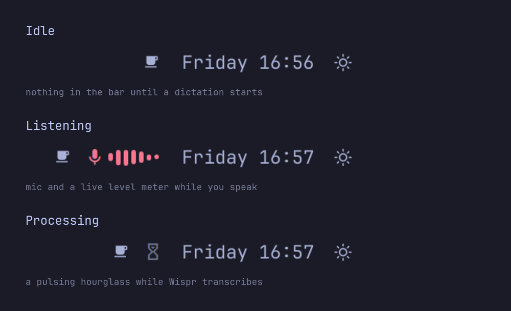

<h1 align="center">Wispr Flow for Omarchy</h1>

<p align="center">
  Wispr Flow's dictation state in the Omarchy bar: hidden while idle, a live mic meter while you speak, an hourglass while it transcribes.
</p>

<p align="center">
  <a href="https://github.com/mcurtis/omarchy-wispr-flow/tags"></a>
  <a href="LICENSE"></a>
</p>

<p align="center">
  
</p>

## What it shows

The widget sits next to the built-in indicators, left of the clock, and takes
no space until a dictation starts. Then it slides in:

- **Starting**: a pulsing mic glyph, while Wispr opens the microphone.
- **Listening**: the mic glyph in the bar's active color, followed by a meter
  that scrolls your input level from right to left, so you can see that Wispr
  is actually hearing you.
- **Processing** ("Transcribing" in the tooltip): a pulsing hourglass while Wispr turns the recording into
  text, typically one to three seconds.
- **Idle**: the widget slides back out.

### The states

| | |
|:---:|:---:|
| <br>**Listening** | <br>**Processing** |
| <br>**Idle**, the widget is gone | |

Hovering shows the current state, and why the widget is running with less than
the full picture if it is (see [Degraded mode](#degraded-mode)). Clicking runs
`/usr/bin/wispr-flow`, the AUR package's launcher. On a vertical bar the widget
shows the glyph only.

It replaces Wispr's own floating Flow bar, which you can then hide
([Hiding Wispr's Flow bar](#hiding-wisprs-flow-bar)).

## Deliberately absent

- **No dictation of its own.** Wispr Flow does the listening, the transcribing
  and the typing. This is a window onto it.
- **No transcript in the bar.** The text goes where you are typing, which is
  where you are looking; a bar is the wrong place to read a sentence.
- **No Voxtype.** Omarchy's built-in dictation already has an indicator, and
  `omarchy.indicators` shows it.
- **No settings for Wispr.** Its shortcuts, languages and Flow bar live in
  Wispr's own settings; this plugin never writes to them.

## Install

```bash
omarchy plugin add https://github.com/mcurtis/omarchy-wispr-flow --enable
omarchy bar put io.github.mcurtis.wispr-flow --after omarchy.indicators
```

`omarchy plugin add` clones the repository into
`~/.config/omarchy/plugins/io.github.mcurtis.wispr-flow/`, and `--enable` adds
the widget to the bar. The second line places it directly after the built-in
indicators, which is where the widget is designed to sit.

It needs Wispr Flow itself, which takes four small fixes on Omarchy: see
[Requirements](#requirements) and
[docs/wispr-flow-on-omarchy.md](docs/wispr-flow-on-omarchy.md).

A working install is invisible until you dictate, so confirm it two ways:

```bash
# Is the plugin loaded? Prints the current state as JSON.
omarchy-shell io.github.mcurtis.wispr-flow status

# Watch it appear in the bar, without Wispr Flow running.
~/.config/omarchy/plugins/io.github.mcurtis.wispr-flow/scripts/simulate.sh --hold 5
```

The second walks the widget through one dictation from a fake log and puts your
settings back afterwards.

## Requirements

- **Omarchy 4.0.3** or later.
- **Wispr Flow for Linux**, the unofficial port at
  [wispr-flow-linux/wispr-flow-linux](https://github.com/wispr-flow-linux/wispr-flow-linux),
  installed from the AUR as `wispr-flow-appimage`. Its launcher is `wispr-flow`
  and it writes the log this plugin follows to
  `~/.cache/wispr-flow/launcher.log`. On Omarchy it needs four small fixes
  before push-to-talk, the shortcuts and browser sign-in work;
  [docs/wispr-flow-on-omarchy.md](docs/wispr-flow-on-omarchy.md) walks through
  the install and each fix.
- **PipeWire**, with `/usr/bin/pw-record` (package `pipewire-audio`), for the
  level meter.
- **Python 3** at `/usr/bin/python3`, for the helper. Standard library only.
- **`setsid` and `setpriv`** from `util-linux`, so the helper runs in its own
  process group and exits with the shell.

All of these ship with Omarchy or with the Wispr package, and every one is run
by its absolute path: nothing is looked up on `PATH`. The plugin needs no
elevated privileges: no sudo or pkexec is required, and nothing is installed
outside the plugin directory.

## Settings

Open the bar settings, or set them from a terminal:

```bash
omarchy bar set io.github.mcurtis.wispr-flow processName wispr-flow
omarchy bar set io.github.mcurtis.wispr-flow bars 9 --json
```

Numbers and booleans need `--json`; plain strings do not. With `--json`, a
string value has to carry its own quotes (`'"wispr-flow"'`).

| Setting | Default | Notes |
|---------|---------|-------|
| `bars` | `7` | Meter bars, 3 to 12. |
| `meter` | `true` | Show the level meter. Off, the widget shows the glyph only and the helper does not record. |
| `logPath` | empty | Wispr's launcher log. Empty means `~/.cache/wispr-flow/launcher.log`. |
| `processName` | `wispr-flow` | The binary name on Wispr's PipeWire capture stream. Change it only if you run a differently named build. |

## How it works

Two signals feed one state.

**PipeWire, for listening.** While Wispr records, PipeWire carries a capture
stream (`Stream/Input/Audio`) whose `application.process.binary` is
`wispr-flow`. The node has to be bound before its properties can be read, so
this signal lands about a second after Wispr starts listening, and disappears
when it stops. The log normally wins that race; with no log, the widget appears
about a second into your first words. Quickshell exposes PipeWire nodes natively, so this
needs no process and does not depend on Wispr's log format. On its own it is
enough to show the widget while you speak. It also tells the helper to start the
meter, so the meter still works when the log is missing — but not when the
helper is.

**The launcher log, for everything else.** Wispr logs one line per state change:

```text
16:42:07.312 › updateDictationStatus: listening {...}
```

A small Python helper follows that file the way `tail -F` does, surviving a
missing, truncated or replaced log, and matches only that line (the log also
holds very large JSON dumps). This is where **starting** and **processing**
come from. It watches the file with inotify, so an idle desktop costs nothing
but a slow backup poll. While Wispr is listening, by either signal, the helper
also reads the default microphone with `pw-record` and reports a level about
20 times a second against an adaptive noise floor, which drives the meter.
When nothing is being dictated it records nothing.

The widget shows **listening** when either signal says so, and **starting** or
**processing** only when the log says so. If Wispr dies in the middle of a
dictation and never logs `idle`, timeouts bring the widget back: 15 seconds
for starting, 60 for processing, 15 minutes for listening. [docs/architecture.md](docs/architecture.md)
has the full picture.

The helper is restarted with a backoff if it exits, and restarted when a
setting it uses changes.

### The helper's boundaries

The helper is the only process the plugin starts, and it is kept on a short
leash:

- **Fixed executables, closed environment.** The shell starts it as
  `/usr/bin/setsid /usr/bin/setpriv --pdeathsig TERM /usr/bin/python3 -I -S
  helper/wispr_flow_status.py`, with an environment that carries only
  `XDG_RUNTIME_DIR` and the PipeWire socket variables `pw-record` needs.
  Nothing is looked up on `PATH`; `-I -S` ignores `PYTHON*` variables and
  every site and user package directory; inotify comes from the interpreter's
  own libc rather than a library search. `pw-record` is likewise
  `/usr/bin/pw-record`, started with the same closed environment.
- **The log is a bounded, plain file.** It is opened without following a
  symlink and is followed only while it is a regular file owned by you;
  anything else counts as absent. Each poll reads at most 64 KiB, a line over
  64 KiB is dropped, and a replaced file over 1 MiB is picked up at its end
  rather than replayed.
- **A heartbeat and a budget.** The helper repeats its record at least every
  5 seconds. The service assembles its output under a 4 KiB line budget and
  kills a helper that exceeds it or goes silent for 30 seconds; a fresh one
  starts after the backoff.
- **Whole-group teardown.** `setsid` gives the helper its own session and
  process group, so a stop, restart or plugin reload sends TERM to the whole
  group, `pw-record` included, then KILL two seconds later for anything left.
  `--pdeathsig` covers the shell itself going away.

### Degraded mode

Each part fails on its own, and the tooltip says which one and what it costs:

| Tooltip reason | What still works |
|---|---|
| Status helper not running (needs /usr/bin/python3 and util-linux) | Listening, from PipeWire. No meter, no starting or transcribing. |
| Wispr log not found at `<path>` | Listening and the meter. No starting or transcribing. |
| pw-record unavailable | Every state, without the meter. |

A missing log usually means Wispr has not been launched since the cache was
cleared, or `logPath` points somewhere else.

To see what the plugin currently believes:

```bash
omarchy-shell io.github.mcurtis.wispr-flow status
```

## Hiding Wispr's Flow bar

Wispr draws its own floating Flow bar at the bottom of the screen. To use this
widget instead:

1. In Wispr Flow, open **Settings → System** and turn off **Show Flow Bar at
   all times**.
2. Wispr still maps a transparent 440×320 status window, which can catch
   clicks along the bottom edge. Park it in a special workspace with a window
   rule in `~/.config/hypr/hyprland.lua`:

```lua
-- Wispr Flow's leftover status window: keep it off screen and out of focus.
o.window({ class = "^wispr-flow$", initial_title = "^Flow Status Indicator$" }, {
  float = true,
  no_initial_focus = true,
  no_focus = true,
  focus_on_activate = false,
  no_anim = true,
  workspace = "special:wispr silent",
})
```

Apply it with `hyprctl reload` and check it with `hyprctl configerrors`, which
prints nothing when the rule is valid. The rule only applies to new windows,
so restart Wispr Flow once. [docs/wispr-flow-on-omarchy.md](docs/wispr-flow-on-omarchy.md#fix-3-the-flow-bar-is-an-empty-framed-box-that-eats-clicks)
also floats Wispr's settings window.

## Troubleshooting

**Nothing appears when I dictate.** Check that the plugin is enabled and placed:
`omarchy plugin list` should show it enabled. Then dictate and, while holding
push-to-talk, list the binaries that own a capture stream:

```bash
pw-dump | jq -r '.[] | select(.info.props["media.class"]? == "Stream/Input/Audio") | .info.props["application.process.binary"]'
```

If Wispr's stream shows up under another name, set `processName` to it.

**The helper is not running.** `pgrep -af wispr_flow_status` should list one
process per shell. If it lists none, the tooltip names the reason; `qs log -p
/usr/share/omarchy/shell/shell.qml -t 200 | grep -i wispr` shows the shell's side.
The helper needs `/usr/bin/python3`, `/usr/bin/setsid` and `/usr/bin/setpriv`
exactly there; it does not search `PATH`.

**The meter is flat.** The meter reads the default PipeWire source. If Wispr
records from a different microphone than your default source, the meter
follows the default one. Check `wpctl status` and set the default source to
the microphone Wispr uses. Also check that `pw-record` exists.

**Processing never shows.** It comes only from the log. Confirm that
`~/.cache/wispr-flow/launcher.log` exists and grows while you dictate, or set
`logPath` if your launcher writes elsewhere.

**Two dictation indicators.** Omarchy has its own indicator for Voxtype, its
built-in dictation tool, and older personal widgets for Wispr may still be
enabled. Remove the extra one with `omarchy plugin disable <id>`.

## Development

Point the shell at a working copy instead of an installed clone:

```bash
ln -sfn ~/path/to/omarchy-wispr-flow ~/.config/omarchy/plugins/io.github.mcurtis.wispr-flow
omarchy-shell shell rescanPlugins
omarchy plugin enable io.github.mcurtis.wispr-flow
omarchy bar put io.github.mcurtis.wispr-flow --after omarchy.indicators
```

Editing the helper does not restart the running one, and on this Omarchy build
QML edits reached through the plugin symlink are not hot-reloaded either.
Changing a setting the helper uses (`logPath` or `meter`) does restart it; for
anything else, including every QML edit, run:

```bash
omarchy-restart-shell
```

Validate the manifest and watch the shell log with:

```bash
omarchy plugin validate .
qs log -p /usr/share/omarchy/shell/shell.qml -t 100
```

`scripts/simulate.sh` drives the widget without Wispr Flow. With the plugin
enabled and on the bar, it writes a fake launcher log, points `logPath` at it,
and walks one push-to-talk cycle (initializing, listening, stopping,
processing, idle) with realistic timing. It puts `logPath` back when it exits,
including on Ctrl-C, a hangup or a broken pipe (only `kill -9` can skip it):

```bash
scripts/simulate.sh                    # one quick dictation
scripts/simulate.sh --hold 30          # hold listening, e.g. for a screenshot
scripts/simulate.sh --cycles 3 --gap 2 # several dictations in a row
```

Listening comes from the fake log, and the meter samples your real default
microphone, so speak while it holds listening if you want to see bars.
`scripts/simulate.sh --help` lists every option. It needs `jq`, as do two of
the troubleshooting commands above; `jq` ships with Omarchy.

The helper's tests use the standard library:

```bash
python3 -m unittest discover tests
```

GitHub Actions runs those tests, `shellcheck scripts/simulate.sh` and a
manifest sanity check on every push.

## Remove

```bash
omarchy plugin remove io.github.mcurtis.wispr-flow
```

This removes the widget from the bar and deletes the plugin directory. The
plugin stores nothing elsewhere. If you added the Hyprland rule above and want
Wispr's Flow bar back, delete the rule and turn **Show Flow Bar at all times** back on in Wispr.

## License

MIT, see [LICENSE](LICENSE). Wispr Flow is a product of Wispr AI, Inc., which
does not sponsor or endorse this plugin.
