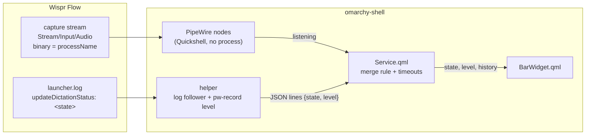

# Architecture

The plugin is a service that owns the dictation state and a bar widget that
draws it. The service combines two independent signals, so either one failing
leaves the other working.



## Merge rule

| PipeWire stream | Log state | Shown |
|---|---|---|
| present | anything | listening |
| absent | `initializing` | starting (helper only) |
| absent | `listening` | listening |
| absent, but a Wispr stream has been seen before | `listening` | listening for 3 s, then idle |
| absent | `stopping`, `processing` | processing (helper only) |
| absent | `idle`, `dismissed`, none | idle |

The rows marked *helper only* need the log follower: starting and processing
exist nowhere else, and if the helper dies mid-transcription the widget drops
straight to idle rather than holding processing.

Listening wins from either side, because the PipeWire stream is the one signal
that cannot drift from what the microphone is actually doing. It is the slower
of the two: the node must be bound before its properties can be read, so it
arrives about a second after Wispr starts listening, and the log usually gets
there first. Starting and
processing exist only in the log, so without the helper the widget goes
straight from idle to listening and back.

A dictation that never reaches `idle`, because Wispr crashed or the log was
replaced mid-dictation, is ended rather than holding the widget open. On a
machine where PipeWire detection works, the three-second stale rule above is
what ends it: the capture stream vanishes when Wispr dies, and the log's
`listening` is disbelieved three seconds later. The helper's own stuck-state
timeouts — 15 seconds in starting, 60 in processing, 15 minutes in listening —
are the fallback for machines where the PipeWire signal never fires at all.

## The helper

The helper, `helper/wispr_flow_status.py`, is a single Python file using only
the standard library. The shell starts it as a direct child, by absolute paths
only, as `/usr/bin/setsid /usr/bin/setpriv --pdeathsig TERM /usr/bin/python3
-I -S`, with a closed environment (`XDG_RUNTIME_DIR` and the PipeWire socket
variables, nothing else). `setsid` makes it the leader of its own session and
process group, `--pdeathsig` ends it with the shell, and it also exits when its
stdin closes. It writes one JSON line per change, and repeats the last one at
least every 5 seconds as a heartbeat:

```json
{"state": "listening", "level": 0.42, "log": true, "meter": true}
```

`state` is what the log says, `log` whether the log file exists, and `meter`
whether a level meter can run. It:

- follows the log like `tail -F`, reopening it when it is created, truncated or
  replaced, and buffering partial lines so a state line split across two writes
  is still read once. The log is opened without following a symlink and is only
  followed while it is a regular file owned by the user; each poll reads at
  most 64 KiB, a line over 64 KiB is dropped, and a replaced file over 1 MiB is
  taken from its end;
- matches only `updateDictationStatus: <state>`, ignoring the multi-kilobyte
  JSON dumps that share the file;
- waits on inotify, with a slow poll as backup and as the only mechanism while
  the log's directory does not exist yet;
- starts `/usr/bin/pw-record` only while listening, whether the log says so or
  the shell reports Wispr's capture stream on the helper's stdin, and computes
  an RMS level against an adaptive noise floor, emitting about 20 levels a
  second;
- stops `pw-record` on every exit path, including SIGTERM.

The service, for its part, assembles the helper's output itself under a 4 KiB
line budget rather than trusting the parser's unbounded buffer, and kills a
helper that exceeds the budget or goes 30 seconds without a line. Every stop,
restart and reload signals the helper's whole process group (TERM, then KILL
two seconds later), so a `pw-record` cannot be left behind. That signal is
`/usr/bin/kill`, started with an empty environment. The only other executable
the plugin runs is `/usr/bin/wispr-flow`, when the widget is clicked: it too
gets a closed environment, a fixed `PATH` of `/usr/bin` plus the session
variables its launcher script and the Electron app read (`BarWidget.qml` lists
them), so nothing the shell inherited reaches either process.

If Python, the log or `pw-record` is unavailable, the service reports a
`degraded` reason that the tooltip shows, and keeps showing listening from
PipeWire.
