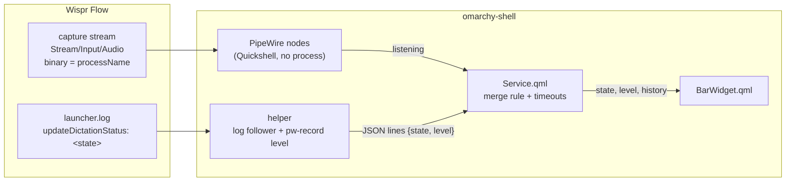

# Architecture

The plugin is a service that owns the dictation state and a bar widget that
draws it. The service combines two independent signals, so either one failing
leaves the other working.



## Merge rule

| PipeWire stream | Log state | Shown |
|---|---|---|
| present | anything | listening |
| absent | `initializing` | starting |
| absent | `listening` | listening |
| absent | `stopping`, `processing` | processing |
| absent | `idle`, `dismissed`, none | idle |

Listening wins from either side, because the PipeWire stream is the one signal
that cannot drift from what the microphone is actually doing. Starting and
processing exist only in the log, so without the helper the widget goes
straight from idle to listening and back.

A dictation that never reaches `idle`, because Wispr crashed or the log was
replaced mid-dictation, is ended by a timeout rather than holding the widget
open: 15 seconds in starting, 60 in processing, 15 minutes in listening.

## The helper

The helper, `helper/wispr_flow_status.py`, is a single Python file using only
the standard library. The shell starts it as a direct child under
`setpriv --pdeathsig TERM`, and it also exits when its stdin closes, so it
cannot outlive the shell. It writes one JSON line per change:

```json
{"state": "listening", "level": 0.42, "log": true, "meter": true}
```

`state` is what the log says, `log` whether the log file exists, and `meter`
whether a level meter can run. It:

- follows the log like `tail -F`, reopening it when it is created, truncated or
  replaced, and buffering partial lines so a state line split across two writes
  is still read once;
- matches only `updateDictationStatus: <state>`, ignoring the multi-kilobyte
  JSON dumps that share the file;
- waits on inotify, with a slow poll as backup and as the only mechanism while
  the log's directory does not exist yet;
- starts `pw-record` only while listening, whether the log says so or the shell
  reports Wispr's capture stream on the helper's stdin, and computes an RMS
  level against an adaptive noise floor, emitting about 20 levels a second;
- stops `pw-record` on every exit path, including SIGTERM.

If Python, the log or `pw-record` is unavailable, the service reports a
`degraded` reason that the tooltip shows, and keeps showing listening from
PipeWire.
